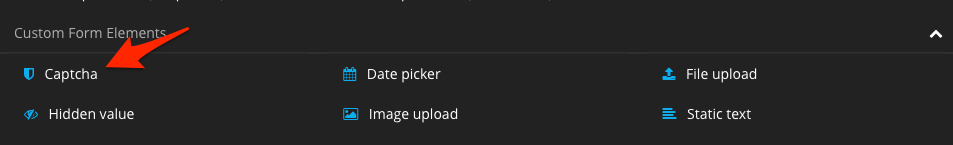

# Wegmeister.Recaptcha

Neos plugin to integrate Google's reCaptcha into Forms. The following form integrations are supported:

* Neos.Form (v4): Google reCaptcha v2 and v3
* Neos.Form.Builder (v2) (: Google reCaptcha v2 and v3
* Neos.Fusion.Form (v2): Google reCaptcha v3

## Installation

Require the package using composer:
```
composer require wegmeister/recaptcha
```

Afterwards, go to [http://www.google.com/recaptcha](http://www.google.com/recaptcha) and create a key for your website. Select the API version you wish to use based on the list above.

## Usage with [Neos.Form](https://github.com/neos/form)

Simply add the new form element to your form definition renderables:

```yaml
type: 'Neos.Form:Form'
identifier: someIdentifier
label: Label
renderables:
  -
    type: 'Neos.Form:Page'
    identifier: page-one
    renderables:
      -
        type: 'Wegmeister.Recaptcha:CaptchaV2'
        identifier: captcha
        label: Captcha
        properties:
          siteKey: your-public-key
          secretKey: your-private-key
          # Optional value if you want to verify the hostname too:
          expectedHostname: 'www.your-domain.com'
          wrapperClassAttribute: 'form-group'
          # Optional values to adjust recaptcha. For further information visit
          # https://developers.google.com/recaptcha/docs/display#config
          theme: 'light'
          type: 'image'
          size: 'normal'
          tabindex: 0
          # If you want to print the recaptche text in a specified language,
          #   you can set that language here.
          # Note: If you use the Neos.Form.Builder package, the language will
          #   automatically be set by your current language dimension.
          #lang: 'de'
        # optionally change the translationPackage
        # if you want to adjust the error message
        #renderingOptions:
        #  validationErrorTranslationPackage: 'Wegmeister.Recaptcha'
finishers:
  -
   <Your finishers here>
```

## Usage with [Neos.Form.Builder](https://github.com/neos/form-builder)

Add a Captcha form element to your form


Configure reCaptcha site key, secret key and other settings from the Inspector

> :exclamation: The old ReCaptcha form element with an additional validator required will be removed in Version 3.x of this plugin. Please update to the new form element.


## Global settings for Neos.Form and Neos.Form.Builder

This plugin will automatically load the required recaptcha/api.js file once. If you already load this file yourself, you can disable it in the settings.
Furthermore, there is a polyfill for `Element.prototype.closest`. If you don't need it, you can disable this, too.

```yaml
Neos:
  Form:
    presets:
      default:
        formElementTypes:
          'Wegmeister.Recaptcha:Captcha':
            renderingOptions:
              # If you have already included the ReCaptcha api.js file yourself, set this to false.
              includeAPIScript: true
              # If you don't need a closest polyfill in js, set this to false.
              includeClosestPolyfill: true
            # Set your siteKey and secretKey in your settings file globally (or if you want to keep it outside your git)
            properties:
              siteKey: 'your-public-key'
              secretKey: 'your-private-key'
```

## Usage with [Neos.Fusion.Form](https://github.com/neos/fusion-form)

> :exclamation: Currently, only reCaptcha v3 is supported with Fusion Forms. Feel free to provide a PR with support for v2.

Add a `FieldContainer` with the `CaptchaV3` element to your form:

    <Neos.Fusion.Form:FieldContainer field.name="captchaV3">
        <Wegmeister.Recaptcha:FusionForm.CaptchaV3 siteKey="your-site-key" action="your-action-name" includeApiScript={true} />
    </Neos.Fusion.Form:FieldContainer>

Set the field name based on our needs, but make sure to use the same field name in the schema (see below).

Since an error message is rendered at the position of the form element, you should place it either at the beginning or at the end of the form. 

The following options are available:

* siteKey (required): The reCaptcha v3 website key.
* action: For statistical purposes, use the action to group the captcha evaluations according to your usage, e.g. "contactForm". [More information](https://developers.google.com/recaptcha/docs/v3#actions)
* includeApiScript: Whether or not the reCaptcha API script should be included. If you already include it globally, set this to false.

Then, add the field to the schema and configure the Validator:

    captchaV3 = ${Form.Schema.string().validator('Wegmeister.Recaptcha:IsValid', {secretKey: 'your-secret-key', errorMessage: 'The reCaptcha check failed. Try submitting the form again.'})}

Make sure that the key (e.g. `captchaV3`) matches the key in the FieldContainer (see above).

The following options are available:

* secretKey (required): The reCaptcha v3 secret key.
* errorMessage: Use this to override the error message in case of a failed captcha check.

## i18n

Currently, the following languages are supported: English, German, French and Dutch
Feel free to send us labels in other languages so we can add them to the plugin.

## Credits

© Benjamin Klix, [die wegmeister gmbh](https://www.die-wegmeister.com/)
